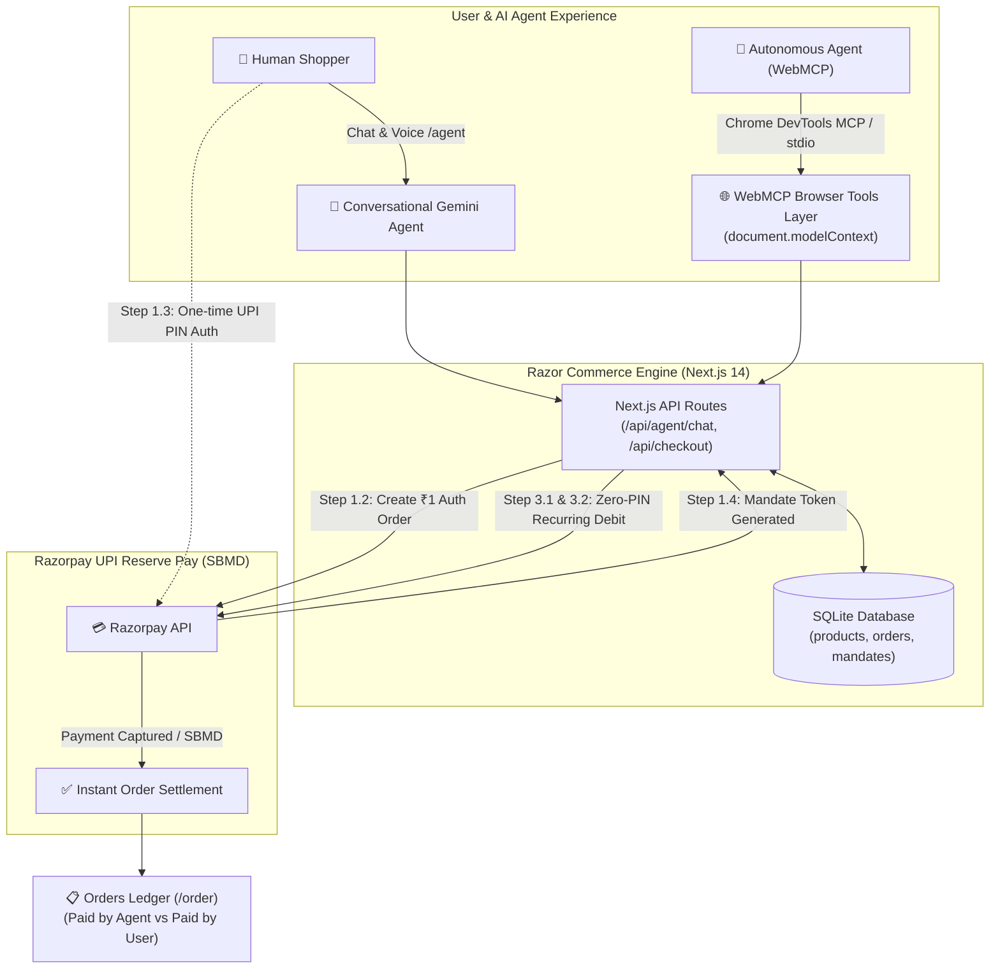

# razor

An autonomous agentic commerce platform integrating conversational AI, WebMCP browser tools, and Razorpay UPI Reserve Pay (Single Block Multiple Debit / SBMD) for hands-free, delegated checkouts.

---

## 1. Problem

### 1.1 Payment in Conversation
As e-commerce shifts toward conversational interfaces and voice/chat AI agents, the checkout experience remains fragmented. Traditional payments require constant context switching—forcing users to abandon the conversation, navigate redirect flows, wait for OTPs, and manually re-enter payment details. This breaks conversational flow, slows purchase momentum, and introduces high checkout friction and cart abandonment.

### 1.2 Agent Has to Pay on Behalf of You
Autonomous AI agents can research products, compare prices, and curate shopping carts, but they hit an impassable barrier when executing payments. Users cannot safely hand over bank passwords, credit card numbers, or UPI PINs to an AI agent due to severe security and privacy hazards. For agents to perform true end-to-end commerce, they need a delegated payment mechanism where users grant permission up to a pre-defined spending limit without ever exposing their secret credentials to the model.

---

## 2. Solution

### 2.1 Using UPI Reserve Pay Powered by Razorpay
UPI Reserve Pay (Single Block Multiple Debit / SBMD) allows the user to authorize a one-time funds block (via a ₹1 auth order) linked to their UPI ID. The AI agent receives a delegation token to execute multiple subsequent purchases autonomously against this reserved limit, debiting funds on demand with zero UPI PIN or user intervention.

### 2.2 Using WebMCP
The platform exposes browser-level agent tools through the WebMCP (`document.modelContext.registerTool`) protocol, enabling external browser agents (Chrome DevTools MCP, Claude Desktop, Cursor) to automate the storefront:

| WebMCP Tool | Input Parameters | Description |
| :--- | :--- | :--- |
| `get_all_products` | `{}` | Lists the complete product catalog including IDs, titles, prices, and available inventory. |
| `search_products` | `{ query: string }` | Searches the catalog by product name, category, or description keywords. |
| `get_product` | `{ id: string }` | Retrieves detailed product specifications, price in paise, stock status, and image URL. |
| `add_to_cart` | `{ id: string, qty: number }` | Adds items to the shopping cart with live server-side stock verification. |
| `view_cart` | `{}` | Returns all items currently in the cart, itemized subtotals, and total payable amount. |
| `remove_from_cart` | `{ id: string }` | Removes a specific product from the cart and recalculates totals. |
| `checkout` | `{ agent_code?: string }` | Executes autonomous purchase using an authorized UPI Reserve Pay `agent_code` delegation token. |
| `get_order_status` | `{ orderId: string }` | Checks real-time order capture status, settlement timestamp, and payment verification. |

---

## Architecture Diagram



---

## How to Install and Check

### Prerequisites
- **Node.js**: Version 18.17.0 or later
- **npm**: Version 9 or later
- **Razorpay Account**: Test mode `RAZORPAY_KEY_ID` and `RAZORPAY_KEY_SECRET`
- **Google AI Studio**: `GEMINI_API_KEY` for conversational commerce

### 1. Installation
Clone the repository and install dependencies:
```bash
git clone https://github.com/djdharani27/razor.git
cd razor/buildathon
npm install
```

### 2. Environment Configuration
Create a `.env.local` file in the `buildathon` root directory:
```env
# Razorpay Test Mode Credentials
RAZORPAY_KEY_ID=rzp_test_your_key_id
RAZORPAY_KEY_SECRET=your_key_secret
RAZORPAY_WEBHOOK_SECRET=your_webhook_secret

# Spend cap in paise (default ₹5,000)
SPEND_CAP_PAISE=500000

# Google Gemini API
GEMINI_API_KEY=your_gemini_api_key
GEMINI_MODEL=gemini-2.0-flash
```

### 3. Start Development Server
```bash
npm run dev
```
The application will start on `http://localhost:3000`.

---

### 4. Verification & Testing Routes

- **`http://localhost:3000/` (Home Gateway)**:
  Clean Neo-Brutalist entrance to select shopping mode:
  - **`👤 Human`**: Opens the `/agent` conversational shopping assistant.
  - **`🤖 Agent`**: Displays the copyable WebMCP configuration for autonomous agents.

- **`http://localhost:3000/agent` (Conversational Commerce)**:
  - Chat with the Gemini AI assistant to search products and add items to cart.
  - Test the **UPI Reserve Pay mandate**: new customers approve a one-time ₹1 authorization popup, automatically capturing the purchase.
  - Repeat purchases complete autonomously with zero PIN.

- **`http://localhost:3000/order` (Orders & Settlement Ledger)**:
  - Live ledger displaying all captured settlements.
  - Clear attribution badges showing whether an order was **`🤖 Paid by Agent`** (autonomous WebMCP mandate) or **`👤 Paid by User`** (direct checkout).

- **`http://localhost:3000/upi-sbmd` (UPI SBMD Sandbox)**:
  - Step-by-step interactive debugger testing each stage of Razorpay UPI Reserve Pay (Customer resolution, Auth order, Token debit, and Mandate management).
